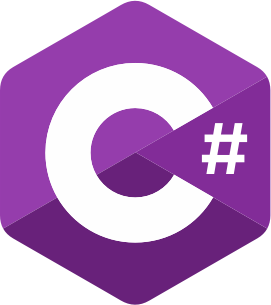

### Hi there 👋

<!--
**tangalbert919/tangalbert919** is a ✨ _special_ ✨ repository because its `README.md` (this file) appears on your GitHub profile.

Here are some ideas to get you started:

- 🔭 I’m currently working on ...
- 🌱 I’m currently learning ...
- 👯 I’m looking to collaborate on ...
- 🤔 I’m looking for help with ...
- 💬 Ask me about ...
- 📫 How to reach me: ...
- 😄 Pronouns: ...
- ⚡ Fun fact: ...
-->

 This README is currently a work in progress.

<h2 align="center">Current projects</h2>
<ul>
  <li>LineageOS maintainer for the OnePlus 9</li>
  <li>Ungoogled-chromium for FreeBSD</li>
  <li>Chromium Canary for Arch Linux</li>
</ul>
<h2 align="center">About me</h2>
<h3>Known languages:</h3>

  
  
  
  <!--
  -->
  

<h3>Stats:</h3>

  

